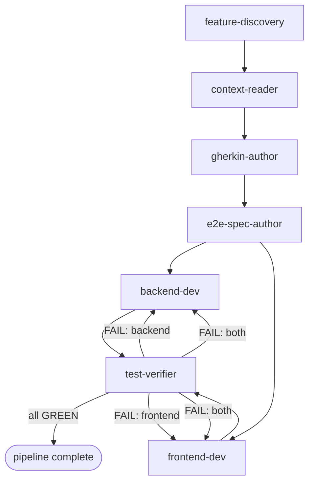

# Agent Pipeline — Feature Development Workflow

This document describes the six-agent pipeline used to develop features in this project. Agents run in a fixed order with a parallel stage for implementation and a feedback loop for test failures.

---

## Pipeline Diagram



---

## Stage-by-Stage Reference

### Stage 0 — feature-discovery

**Role:** Intake agent. Takes raw feature ideas from the user, decides the PRD target, runs a structured Q&A loop, and writes finalised requirements into the chosen PRD file before any implementation agent is invoked.

**Inputs:** Raw feature description(s) from the user.

**Sub-steps:**

1. **Version decision** — Read `docs/PRD.md` and all `docs/product-requirements/PRD_V{N}.md` files to find the latest version. Decide whether the new features extend it in-place or warrant a new `PRD_V{N+1}.md`:
   - Extend in-place if the features are small additions to a version still marked *In Progress*.
   - Create a new version if the latest version is *Complete* or the features constitute a distinct product increment.

2. **Open questions** — Surface ambiguities as a numbered list covering: data model impact, auth requirements, API shape, UI interactions, and out-of-scope boundaries.

3. **Q&A loop** — Present questions to the user one batch at a time. After each answer, reason about the consequences of that decision — what new constraints it implies, what edge cases it opens, what downstream agents (data model, API shape, auth, UI) it affects — and derive follow-up questions from that reasoning. Update the working feature definition after each exchange. Loop until no unresolved questions remain and the definition is unambiguous enough to hand off to `context-reader`.

4. **Write requirements** — Append the new feature rows (with IDs continuing from the last F-N in the chosen file) to the target PRD, following the existing table format. If a new `PRD_V{N+1}.md` was created, update the version table in `docs/PRD.md` accordingly.

**Output:**
- Updated `docs/product-requirements/PRD_V{N}.md` (or new `PRD_V{N+1}.md`) with new F-N rows.
- Updated `docs/PRD.md` version table (only if a new PRD file was created).
- A summary of the finalised feature IDs for the orchestrator to pass to `context-reader`.

**Can be skipped:** Yes — if the feature is already fully described in a PRD file, go straight to Stage 1.

---

### Stage 1 — context-reader

**Role:** Read-only research agent. Gathers all context needed to implement a feature and produces a structured brief that every downstream agent consumes.

**Inputs:** Feature ID(s) from the orchestrator (e.g. `F-25`).

**Reads:**
- `CLAUDE.md`
- `docs/PRD.md` and `docs/product-requirements/PRD_V{N}.md`
- `docs/ARCHITECTURE.md` and `docs/testing/TESTING_WORKFLOW.md`
- All source under `apps/backend/src/` and `apps/frontend/src/`
- All Gherkin and Playwright files under `bdd/`
- `bdd/tests/helpers.ts`

**Output:** Structured context brief with sections: Feature Summary, Data Model Changes, Already Implemented, Out of Scope, Naming to Follow, Test Helper Additions, Open Questions.

**Blocking behaviour:** If there are ambiguous points in the PRD or a naming conflict, `context-reader` lists them under Open Questions and waits for orchestrator answers before finalising the brief. The brief is the single source of truth for all downstream agents.

**Can be skipped:** Never — always the first stage.

---

### Stage 2 — gherkin-author

**Role:** Translates the context brief's acceptance criteria into a Gherkin `.feature` file.

**Inputs:**
- Context brief from `context-reader`
- Feature ID(s)

**Output:** `bdd/features/vN_featureName.feature`

**Can be skipped:** Only if a `.feature` file already exists for this feature and has not changed.

---

### Stage 3 — e2e-spec-author

**Role:** Implements every Gherkin scenario as a Playwright test, 1:1. Tests are written RED — they target code that does not exist yet.

**Inputs:**
- `.feature` file from `gherkin-author`
- Context brief from `context-reader`

**Output:**
- `bdd/tests/vN_featureName.spec.ts`
- Updated `bdd/tests/helpers.ts` (if new shared utilities are needed)

**Can be skipped:** Only if the `.spec.ts` file already exists and covers all current scenarios.

---

### Stage 4 — backend-dev and frontend-dev (parallel)

Both agents start as soon as `e2e-spec-author` delivers the `.spec.ts` file. They operate on entirely separate parts of the codebase and have no shared file dependencies — launch them concurrently.

#### backend-dev

**Role:** Backend TDD implementor. Writes failing JUnit 5 tests then implements the minimum Spring Boot code to make them pass.

**Inputs:**
- Context brief from `context-reader`
- `.spec.ts` file from `e2e-spec-author` (defines the exact API contract)

**Scope:** `apps/backend/` only.

**Output:** Failing JUnit tests + passing implementation (controller, service, repository, DB migration as needed).

#### frontend-dev

**Role:** Frontend TDD implementor. Writes failing Vitest tests then implements the minimum React/TypeScript code to make them pass.

**Inputs:**
- Context brief from `context-reader`
- `.spec.ts` file from `e2e-spec-author` (defines the exact DOM selectors and UI flows)

**Scope:** `apps/frontend/` only.

**Output:** Failing Vitest tests + passing implementation (components, API client additions, App integration).

**Can be skipped:** Yes — skip for backend-only features with no new UI elements.

---

### Stage 5 — test-verifier

**Role:** Quality gate. Runs all three Docker Compose test suites and either confirms GREEN or produces structured failure briefs targeting the responsible agent.

**Test suites:**
```bash
docker compose --profile test run --rm backend-test
docker compose --profile test run --rm frontend-unit-test
docker compose --profile test run --rm e2e-test
```

**Output (all pass):**
```
✅ All test suites GREEN
```

**Output (failure):** One structured failure brief per failing suite, identifying the responsible agent (`backend-dev` or `frontend-dev`), failing test(s), diagnosis, and files most likely to fix.

**Can be skipped:** Never — it is the quality gate.

---

## Feedback Loop

When `test-verifier` reports failures:

1. The orchestrator passes the failure brief to the responsible agent.
2. The agent applies fixes within its scope (`apps/backend/` or `apps/frontend/`).
3. The orchestrator invokes `test-verifier` again.
4. Repeat until all three suites are GREEN.

E2E failures are triaged by failure type: API failures go to `backend-dev`, DOM/UI failures go to `frontend-dev`. If both are implicated, separate briefs are produced for each.

---

## Skippable Agents Summary

| Agent | Skippable? | Condition |
|---|---|---|
| feature-discovery | Yes | Feature already fully described in PRD |
| context-reader | No | Always first after discovery |
| gherkin-author | Rarely | `.feature` file already exists and is current |
| e2e-spec-author | Rarely | `.spec.ts` file already exists and covers all scenarios |
| backend-dev | No | Backend always needs implementation |
| frontend-dev | Yes | Feature has no new frontend UI elements |
| test-verifier | No | Always the quality gate |

---

## How to Invoke Each Agent

**Step 0 — Discover and define features:**
```
Describe the feature idea(s) in plain language. feature-discovery will
determine the PRD target, ask clarifying questions, and write the
finalised requirements before the pipeline proceeds.
```

**Step 1 — Gather context:**
```
Use context-reader to produce a brief for feature F-{N}.
```

**Step 2 — Write Gherkin:**
```
Use gherkin-author to write the .feature file for F-{N} using the context brief above.
```

**Step 3 — Write E2E spec:**
```
Use e2e-spec-author to write the Playwright spec for the .feature file just created, using the context brief.
```

**Steps 4a + 4b — Implement (launch both in the same message to run in parallel):**
```
Use backend-dev to implement F-{N} using the context brief and the .spec.ts file just created.
Use frontend-dev to implement F-{N} using the context brief and the .spec.ts file just created.
```
(Skip `frontend-dev` for backend-only features.)

**Step 5 — Verify:**
```
Use test-verifier to run all three test suites and report results.
```

If `test-verifier` reports failures, pass the failure brief to the responsible agent and re-invoke `test-verifier` after fixes.
